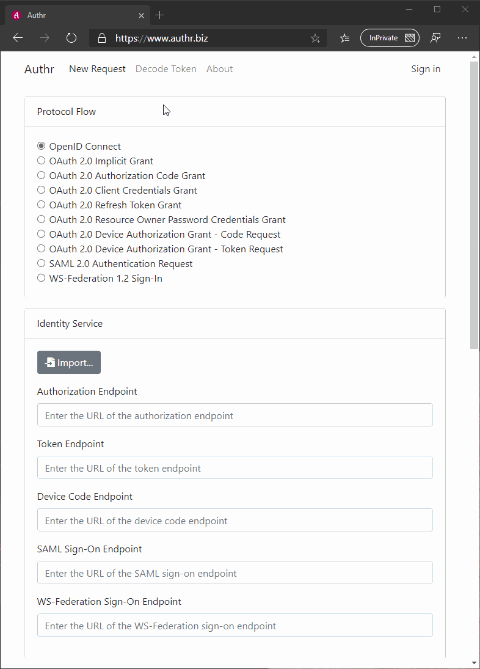

# Authr

## About

[Authr](https://www.authr.biz/) is a generic web application that you can use to test various authentication and authorization scenarios such as **OpenID Connect**, **OAuth 2.0**, **SAML 2.0** and **WS-Federation 1.2** - with any identity service that is compliant with these protocols.

You can simply start a new request using the parameters of your choice, and after the flow is complete you will see the full details and the final response(s) - decoded and interpreted whenever possible.

You can also just use the token decoder directly if you have a JWT or SAML token and want to see the contents. Note that in that case the token is decoded on your device and will never leave your browser!

If you choose to create an account and sign in to Authr, you can also save the configuration details of your favorite identity services, client applications and even complete request templates for easier reuse later on.

## License

This project is licensed under the MIT License - see the [LICENSE](LICENSE) file for details.
